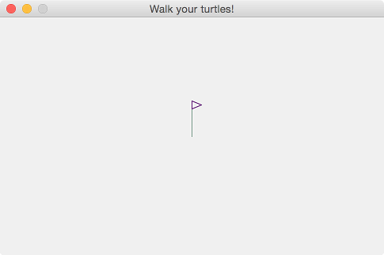
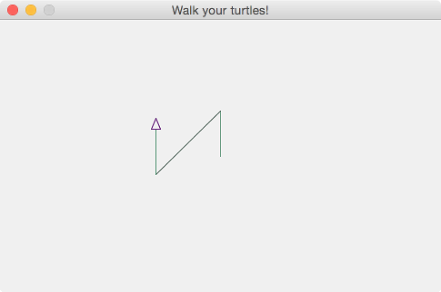
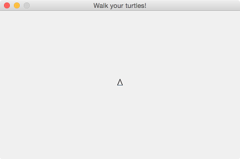
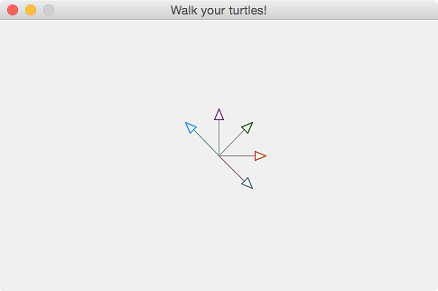

# Turtles App Samples

Here are some samples from very basic to a little bit high level ones.

Draw lines by your imagination!

#### 1. start up

To start up on LightTable, open file
`welcomeclojurebridge/src/clojurebridge_turtle/walk.clj`.
Then,
<kbd>Ctrl</kbd> + <kbd>Shift</kbd> + <kbd>Enter</kbd> or
<kbd>Cmd</kbd> + <kbd>Shift</kbd> + <kbd>Enter</kbd> to evaluate the file.

On repl, run `require` and `ns`.

```clojure
user=> (require 'clojurebridge-turtle.walk)
nil
user=> (ns clojurebridge-turtle.walk)  ;; no need to run this on LightTable
nil
clojurebridge-turtle.walk=> (turtle-names)
(:trinity)
clojurebridge-turtle.walk=> (state)
[:trinity {:x 0, :y 0, :angle 90, :color [30 30 30]}]
```


#### 2. Basic movement - forward, backward, right and left

- forward

```clojure
clojurebridge-turtle.walk=> (forward 40)
[:trinity 40]
```


- right

```clojure
clojurebridge-turtle.walk=> (right 90)
[:trinity 90]
```



- combinations of forward and right

```clojure
clojurebridge-turtle.walk=> (forward 40)
[:trinity 40]
clojurebridge-turtle.walk=> (right 90)
[:trinity 90]
clojurebridge-turtle.walk=> (forward 50)
[:trinity 50]
clojurebridge-turtle.walk=> (right 90)
[:trinity 90]
clojurebridge-turtle.walk=> (forward 60)
[:trinity 60]
clojurebridge-turtle.walk=> (right 90)
[:trinity 90]
clojurebridge-turtle.walk=> (forward 70)
[:trinity 70]
clojurebridge-turtle.walk=> (right 90)
[:trinity 90]
clojurebridge-turtle.walk=> (forward 80)
[:trinity 80]
```


- combination of various commands

```clojure
clojurebridge-turtle.walk=> (init)
:trinity
clojurebridge-turtle.walk=> (forward 50)
[:trinity 50]
clojurebridge-turtle.walk=> (right 45)
[:trinity 45]
clojurebridge-turtle.walk=> (backward 100)
[:trinity -100]
clojurebridge-turtle.walk=> (left 45)
[:trinity -45]
clojurebridge-turtle.walk=> (forward 50)
[:trinity 50]
clojurebridge-turtle.walk=> (state)
[:trinity {:x -70.71068094436272, :y 29.289320335914155, :angle 90, :color [30 30 30]}]
```




#### 3. Using multiple turtles

- add turtles

```clojure
clojurebridge-turtle.walk=> (init)
:trinity
clojurebridge-turtle.walk=> (add-turtle)
[:smith0 {:x 0, :y 0, :angle 90, :color [10 107 30]}]
clojurebridge-turtle.walk=> (add-turtle)
[:smith1 {:x 0, :y 0, :angle 90, :color [10 107 30]}]
clojurebridge-turtle.walk=> (add-turtle)
[:smith2 {:x 0, :y 0, :angle 90, :color [10 107 30]}]
clojurebridge-turtle.walk=> (turtle-names)
(:trinity :smith0 :smith1 :smith2)
```



- make smiths tilt different angles

```clojure
clojurebridge-turtle.walk=> (right :smith0 (* 1 45))
[:smith0 45]
clojurebridge-turtle.walk=> (right :smith1 (* 2 45))
[:smith1 90]
clojurebridge-turtle.walk=> (right :smith2 (* 3 45))
[:smith2 135]
```


- walk four turtles forward

```clojure
clojurebridge-turtle.walk=> (forward :trinity 40)
[:trinity 40]
clojurebridge-turtle.walk=> (forward :smith0 40)
[:smith0 40]
clojurebridge-turtle.walk=> (forward :smith1 40)
[:smith1 40]
clojurebridge-turtle.walk=> (forward :smith2 40)
[:smith2 40]
```


#### 4. add more turtles and give them commands

- add another turtle named :neo

```clojure
clojurebridge-turtle.walk=> (add-turtle :neo)
[:neo {:x 0, :y 0, :angle 90, :color [75 0 130]}]
```


- tilt and go forward :neo

```clojure
clojurebridge-turtle.walk=> (left :neo 45)
[:neo -45]
clojurebridge-turtle.walk=> (forward :neo 40)
[:neo 40]
clojurebridge-turtle.walk=> (turtle-names)
(:trinity :smith0 :smith1 :smith2 :neo)
```




#### 5. move all five turtles - introduction to function

How can we make all five turtles go forward by 40?
The simplest way would be to type `(forward :name 40)` five times.

But wait and think.
Is there any handy way of doing this?
Yes, there is.
Clojure has many functions to accomplish this purpose.

- move 5 turtles forward using `doseq` function

```clojure
clojurebridge-turtle.walk=> (doseq [n (turtle-names)] (forward n 40))
nil
```


- [bonus] using `map` function (higher order function)

```clojure
clojurebridge-turtle.walk=> (map #(forward % 40) (turtle-names))
([:trinity 40] [:smith0 40] [:smith1 40] [:smith2 40] [:neo 40])
```


- tilt and forward them by `doseq`s

```clojure
clojurebridge-turtle.walk=> (doseq [n (turtle-names)] (right n 60))
nil
clojurebridge-turtle.walk=> (doseq [n (turtle-names)] (forward n 30))
nil
```


- [bonus] put two `doseq`s in one
```clojure
clojurebridge-turtle.walk=> (doseq [n (turtle-names)]
                       #_=> (right n 60)
                       #_=> (forward n 30))
nil
```


#### 6. write your own functions

- rewrite adding three turtles and turtle the :neo

```clojure
;; function definition
(defn five-turtles
  []
  (init)
  (dotimes [n 3] (add-turtle))
  (add-turtle :neo))

;; usage of the five-turtles function
(five-turtles)

;; check turtle names
(turtle-names)
```


#### side note: forward 480 and 48 times of forward 10

To see the difference, let define utility function, `leftmost`.
This function moves turtle head to the leftmost position.

```clojure
;; function definition

(defn leftmost
  [n]
  (home n)
  (clean n)
  (left n 90)
  (forward n 240)
  (clean n)
  (right n 180))
```

Then, try two forwards.

```clojure
clojurebridge-turtle.walk=> (leftmost :trinity)
[:trinity 180]

;; forward 480
clojurebridge-turtle.walk=> (forward 480)
[:trinity 480]
```


```clojure
clojurebridge-turtle.walk=> (leftmost :trinity)
[:trinity 180]

;; 48 times of forward 10
clojurebridge-turtle.walk=> (dotimes [i 48] (forward 10))
nil
```


####

Writing a function makes this easy.

```clojure
;; function definition
(defn doseq-with-params
  [len1 len2 angle]
  (doseq [n (turtle-names)]
    (forward n len1)
    (right n angle)
    (forward n len2)))

;; usage example
(doseq-with-params 80 40 120)
```


#### 

Writing own function will make it easy to setup some state.

Assuming there are already four turtles added,
the function `four-turtles` brings the state back to "3. add turtles and give them commands".

```clojure
;; definition of four-turtles functions

(defn four-turtles
  []
  (clean-all)
  (home-all)
  (left :smith0 45)
  (right :smith1 45)
  (right :neo 90)
  (doseq [n (turtle-names)]
    (forward n 50)))

;; usage of four-turtles function above
(four-turtles)
```


License
-------
<a rel="license"
href="http://creativecommons.org/licenses/by/4.0/deed.en_US"></a><br
/><span xmlns:dct="http://purl.org/dc/terms/"
href="http://purl.org/dc/dcmitype/Text" property="dct:title"
rel="dct:type">ClojureBridge Curriculum</span> by <span
xmlns:cc="http://creativecommons.org/ns#"
property="cc:attributionName">ClojureBridge</span> is licensed under a
<a rel="license"
href="http://creativecommons.org/licenses/by/4.0/deed.en_US">Creative
Commons Attribution 4.0 International License</a>.
