# Turtles App Samples

Here are some samples from very basic to a little bit high level ones.

Draw lines by your imagination!

#### 1. start up

- preparation

If you haven't cloned out the repository, try this on the terminal:

```bash
git clone https://github.com/ClojureBridge/welcometoclojurebridge
cd welcometoclojurebridge
```

- load walk.clj on LightTable

open the file
`welcomeclojurebridge/src/clojurebridge_turtle/walk.clj`.
Then,
<kbd>Ctrl</kbd> + <kbd>Shift</kbd> + <kbd>Enter</kbd> or
<kbd>Cmd</kbd> + <kbd>Shift</kbd> + <kbd>Enter</kbd> to evaluate the file.

- load walk.clj on lein repl

startup repl, then run `require` and `ns`.

```clojure
user=> (require 'clojurebridge-turtle.walk)
nil
user=> (ns clojurebridge-turtle.walk)  ;; no need to run this on LightTable
nil
clojurebridge-turtle.walk=> (turtle-names)
(:trinity)
clojurebridge-turtle.walk=> (state)
[:trinity {:x 0, :y 0, :angle 90, :color [30 30 30]}]
```

- initial state


See [TURTLE.md](TURTLE.md) for commands that turtles understand.


#### 2. [easy] Basic movement - forward, backward, right and left

- forward

```clojure
clojurebridge-turtle.walk=> (forward 40)
[:trinity 40]
```


- right

```clojure
clojurebridge-turtle.walk=> (right 90)
[:trinity 90]
```


- combinations of forward and right

```clojure
clojurebridge-turtle.walk=> (forward 40)
[:trinity 40]
clojurebridge-turtle.walk=> (right 90)
[:trinity 90]
clojurebridge-turtle.walk=> (forward 50)
[:trinity 50]
clojurebridge-turtle.walk=> (right 90)
[:trinity 90]
clojurebridge-turtle.walk=> (forward 60)
[:trinity 60]
clojurebridge-turtle.walk=> (right 90)
[:trinity 90]
clojurebridge-turtle.walk=> (forward 70)
[:trinity 70]
clojurebridge-turtle.walk=> (right 90)
[:trinity 90]
clojurebridge-turtle.walk=> (forward 80)
[:trinity 80]
```

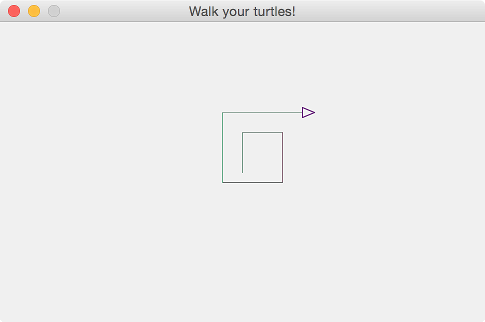


- combination of various commands

```clojure
clojurebridge-turtle.walk=> (init)
:trinity
clojurebridge-turtle.walk=> (forward 50)
[:trinity 50]
clojurebridge-turtle.walk=> (right 45)
[:trinity 45]
clojurebridge-turtle.walk=> (backward 100)
[:trinity -100]
clojurebridge-turtle.walk=> (left 45)
[:trinity -45]
clojurebridge-turtle.walk=> (forward 50)
[:trinity 50]
clojurebridge-turtle.walk=> (state)
[:trinity {:x -70.71068094436272, :y 29.289320335914155, :angle 90, :color [30 30 30]}]
```


#### 3. [easy] Multiple turtles

- add turtles

```clojure
clojurebridge-turtle.walk=> (init)
:trinity
clojurebridge-turtle.walk=> (add-turtle)
[:smith0 {:x 0, :y 0, :angle 90, :color [10 107 30]}]
clojurebridge-turtle.walk=> (add-turtle)
[:smith1 {:x 0, :y 0, :angle 90, :color [10 107 30]}]
clojurebridge-turtle.walk=> (add-turtle)
[:smith2 {:x 0, :y 0, :angle 90, :color [10 107 30]}]
clojurebridge-turtle.walk=> (turtle-names)
(:trinity :smith0 :smith1 :smith2)
```


- make smiths tilt different angles

```clojure
clojurebridge-turtle.walk=> (right :smith0 (* 1 45))
[:smith0 45]
clojurebridge-turtle.walk=> (right :smith1 (* 2 45))
[:smith1 90]
clojurebridge-turtle.walk=> (right :smith2 (* 3 45))
[:smith2 135]
```


- walk four turtles forward

```clojure
clojurebridge-turtle.walk=> (forward :trinity 40)
[:trinity 40]
clojurebridge-turtle.walk=> (forward :smith0 40)
[:smith0 40]
clojurebridge-turtle.walk=> (forward :smith1 40)
[:smith1 40]
clojurebridge-turtle.walk=> (forward :smith2 40)
[:smith2 40]
```

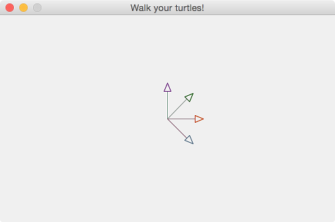


#### 4. [easy] Add one more turtle and give them commands

- add another turtle named :neo

```clojure
clojurebridge-turtle.walk=> (add-turtle :neo)
[:neo {:x 0, :y 0, :angle 90, :color [75 0 130]}]
```


- tilt and go forward :neo

```clojure
clojurebridge-turtle.walk=> (left :neo 45)
[:neo -45]
clojurebridge-turtle.walk=> (forward :neo 40)
[:neo 40]
clojurebridge-turtle.walk=> (turtle-names)
(:trinity :smith0 :smith1 :smith2 :neo)
```


- walk five turtles forward by 20

```clojure
clojurebridge-turtle.walk=> (forward :trinity 20)
[:trinity 20]
clojurebridge-turtle.walk=> (forward :smith0 20)
[:smith0 20]
clojurebridge-turtle.walk=> (forward :smith1 20)
[:smith1 20]
clojurebridge-turtle.walk=> (forward :smith2 20)
[:smith2 20]
clojurebridge-turtle.walk=> (forward :neo 20)
[:neo 20]
```

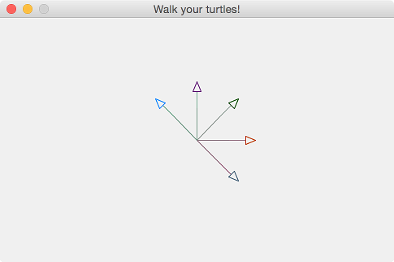


#### 5. [easy - intermediate] Move all five turtles - introduction to function

We've had five turtles and want to move or tilt those five.
Let's think how we can make all five turtles go forward by 40?
The simplest way would be to type `(forward :name 40)` five times.

But wait. We are almost exhausted to type quite similar commands many times.
Is there any handy way of doing this? Yes, there is.
Clojure has many functions to accomplish this purpose.
`doseq` function is one of them.

- 5.1 move 5 turtles forward using `doseq` function

```clojure
clojurebridge-turtle.walk=> (doseq [n (turtle-names)] (forward n 40))
nil
```

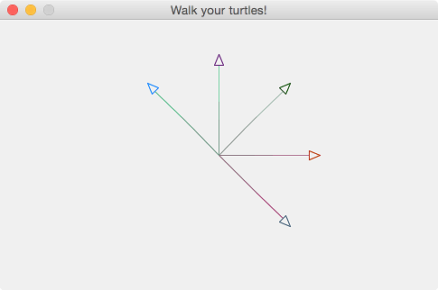


- 5.2 [bonus] using `map` function (higher order function)

```clojure
clojurebridge-turtle.walk=> (map #(forward % 40) (turtle-names))
([:trinity 40] [:smith0 40] [:smith1 40] [:smith2 40] [:neo 40])
```


- 5.3 tilt and forward them by `doseq`s

```clojure
clojurebridge-turtle.walk=> (doseq [n (turtle-names)] (right n 60))
nil
clojurebridge-turtle.walk=> (doseq [n (turtle-names)] (forward n 30))
nil
```

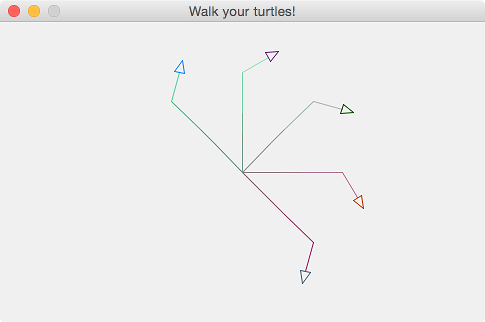


- 5.4 [bonus] put two `doseq`s in one

```clojure
clojurebridge-turtle.walk=> (doseq [n (turtle-names)]
                       #_=> (right n 60)
                       #_=> (forward n 30))
nil
```

- 5.5 [bonus] using `map` (higher order function) and `juxt` functions

```clojure
clojurebridge-turtle.walk=> (map (juxt #(right % 60) #(forward % 30)) (turtle-names))
([[:trinity 60] [:trinity 30]] [[:smith0 60] [:smith0 30]]
[[:smith1 60] [:smith1 30]] [[:smith2 60] [:smith2 30]] [[:neo 60]
[:neo 30]])
```


#### 6. [easy - intermediate] Write a function that adds turtles

While playing around with turtles, we may mess up their movements.
The `(init)` command makes everything clean up and back to the initial state.
It is a good command, but again, we need to repeat `(add-turtle)`
command many times to get five turtles.

We want something. Yes, we can define our own function for that.
Once the function is defined, we can add five turtles by a single
function call anytime.


- 6.1 define a function to add three turtles and a turtle with the name :neo

Since we already have :trinity, we are going to add three smiths
and :neo. After that, we will have five turtles in total.

```clojure
;; function definition
(defn add-four-turtles
  []
  (init)
  (dotimes [i 3] (add-turtle))
  (add-turtle :neo))

;; usage of the five-turtles function
(add-four-turtles)

;; check turtle names
(turtle-names)
```


- 6.2 [bonus] add a parameter to `add-four-turtles` function so that the last turtle can
take any name

Our `add-four-turtles` function only add :neo in the end.
Instead, let's give a freedom to choose any name for the last turtle.

```clojure
;; function definition
(defn add-four-turtles
  ([] (add-four-turtles :neo))
  ([n]
    (init)
    (dotimes [i 3] (add-turtle))
    (add-turtle n)))

;; usage example
(add-four-turtles :oracle)

;; check turtle names
(turtle-names)
```

#### 7. [intermediate - difficult] Write a function that tilts five turtles in different directions

Next, we want to tilt five turtles' heads in different angles so that we can
see their move well.
For example, :trinity 0, :smith0 45, :smith1 90, :smith2 135,
:neo 180.
To write this function is no more straightforward since we need two
kinds of parameters at the same time, name and angle.

Again, Clojure has many ways to do this.

- 7.1 using `doseq` with a little tweak

Let's think how we can use `doseq` here also.

- 7.1.1 put two parameters in one hash map

If we put two-parameter pair together to form one, we can use `doseq` like previous examples.

```clojure
;; put turtle names and digits together and create a hash map
clojurebridge-turtle.walk=> (def m (zipmap (turtle-names) (range 0 (count (turtle-names)))))
#'clojurebridge-turtle.walk/m
clojurebridge-turtle.walk=> m
{:trinity 0, :smith0 1, :smith1 2, :smith2 3, :neo 4}

;; see each part is doing what
clojurebridge-turtle.walk=> (count (turtle-names))
5
clojurebridge-turtle.walk=> (range 0 5)
(0 1 2 3 4)
clojurebridge-turtle.walk=> (zipmap [:a :b] [0 1])
{:a 0, :b 1}
```

- 7.1.2 use `doseq` to iterate hash map

```clojure
;; using m which is created by zipmap
(doseq [t m] (right (first t) (* (second t) 45)))

;; again, see each part is doing what

;; see how doseq uses m
clojurebridge-turtle.walk=> (doseq [t m] (prn t))
[:trinity 0]
[:smith0 1]
[:smith1 2]
[:smith2 3]
[:neo 4]
nil

;; see first and second function do
clojurebridge-turtle.walk=> (doseq [t m] (prn (first t) (second t)))
:trinity 0
:smith0 1
:smith1 2
:smith2 3
:neo 4
nil

;; see what (* (second t) 45) does
clojurebridge-turtle.walk=> (doseq [t m] (prn (first t) (* (second t) 45)))
:trinity 0
:smith0 45
:smith1 90
:smith2 135
:neo 180
nil
```

- 7.1.3 put hash map creation and `doseq` in one function

```clojure
;; function definition
(defn tilt-turtles
  []
  (let [m (zipmap (turtle-names) (range 0 (count (turtle-names))))]
    (doseq [t m] (right (first t) (* (second t) 45)))))

;; usage
(tilt-turtles)
```

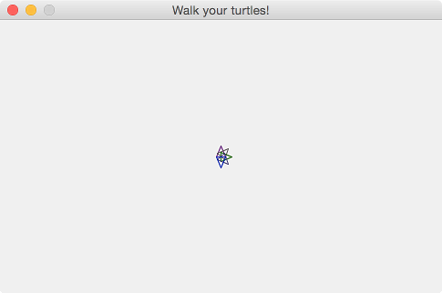


- 7.2 [bonus] map function (higher order function) is another way to do

Using `map` function, tilt-turtles function can be written a single
line as in below.

```clojure
clojurebridge-turtle.walk=> (map #(right % (* %2 45)) (turtle-names) (range 0 (count (turtle-names))))
([:trinity 0] [:smith0 45] [:smith1 90] [:smith2 135] [:neo 180])
```

- 7.3 [bonus] recursion is another way to do

```clojure
;; function definition
(defn tilt-turtles-loop
  []
  (loop [t nil
         n (turtle-names)
         s 0]
    (if (empty? n) :completed
        (recur (right (first n) (* s 45)) (rest n) (inc s)))))

;; usage
(tilt-turtles-loop)
```

#### 8. [intermediate] Write a function that moves five turtles forward, right and forward again

We got five turtles, made their heads tilted in different directions.
It's time to move all those five turtles, forward, right and forward.

- 8.1 put three movements in one `doseq`

Like we tried in 5.4, only one `doseq` works for the three movements.

```clojure
(doseq [n (turtle-names)]
  (forward n 60)
  (right n 90)
  (forward n 50))
```

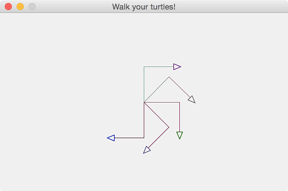


- 8.2 change parameters of forwards and right

Putting three movements in one `doseq` is nice, but what if we want to
change parameters?
For example, forward 100, right 150, then forward 60, or
forward 50, right 30, and forward 60.

Defining a function that takes parameters is the way to do.

```clojure
;; function definition
(defn doseq-with-params
  [len1 len2 angle]
  (doseq [n (turtle-names)]
    (forward n len1)
    (right n angle)
    (forward n len2)))

;; usage example
(home-all)
(clean-all)
(tilt-turtles)

(doseq-with-params 100 60 150)
```

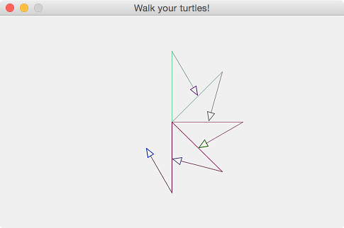


Try various parameters.


#### 9. [intermediate] put whole stuff in a function

So far, we added four turtles and got five in total.
Each turtle's head was tilted in a different direction.
Finally, five turtles walked forward, changed heads by some degrees,
then walked again.
There were three steps.

We've already learned writing a function makes things put into one, and
repeating the same sequence makes very easy.

- 9.1 write a function so that all three steps can be done by only one function.

```clojure
;; definition of walk-five-turtles functions
(defn walk-five-turtles
  [name len1 len2 angle]
  (add-four-turtles name)
  (tilt-turtles)
  (doseq-with-params len1 len2 angle))

;; usage examples
(walk-five-turtles :oracle 10 60 90)
```

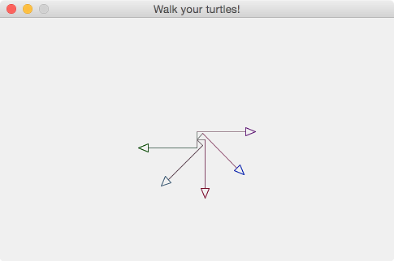


- 9.2 [bonus] use hash map as a function parameter

As a number of function parameters increases, it goes confusing.
For example, if we misunderstand the order of len2 and angle, turtles
may go beyond the boundary.

To solve this problem, hash map is often used as a function parameter.
The parameters in the hash map are picked up using destructuring.
It is handy.


```clojure
;; function definition
(defn walk-five-turtles-map
  [{:keys [name len1 len2 angle]}]
  (add-four-turtles name)
  (tilt-turtles)
  (doseq-with-params len1 len2 angle))


;; usage example
(walk-five-turtles-map {:name :oracle :len1 10 :len2 60 :angle 90})
```

If we look at the usage example, it's clear what parameter goes where.


#### #. side note: forward 480 and 48 times of forward 10

Going forward 480 and repeating 48 times of forward 10 are not the
same for the turtles.
To see the difference, let define an utility function, `leftmost` first.
This function moves a turtle to the leftmost position.

```clojure
;; function definition

(defn leftmost
  [n]
  (home n)
  (clean n)
  (left n 90)
  (forward n 240)
  (clean n)
  (right n 180))
```

Once the turtle moves to the leftmost position, try two types of forwards.

```clojure
clojurebridge-turtle.walk=> (leftmost :trinity)
[:trinity 180]

;; forward 480
clojurebridge-turtle.walk=> (forward 480)
[:trinity 480]
```

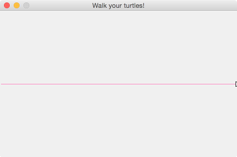

```clojure
clojurebridge-turtle.walk=> (leftmost :trinity)
[:trinity 180]

;; 48 times of forward 10
clojurebridge-turtle.walk=> (dotimes [i 48] (forward 10))
nil
```
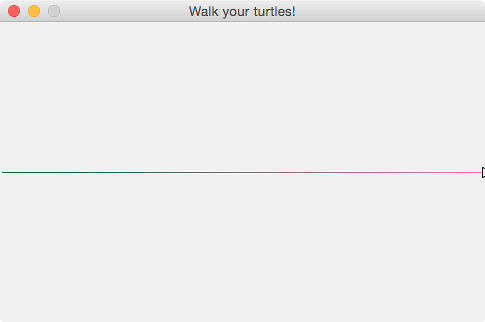


Both walked the turtle from the leftmost to rightmost position,
however, the colors are not the same.
The stroke's color is calculated from the x, y values of the endpoint.
Forwarding 480 has only one endpoint, while forwarding 48 times has 48
endpoints.
This means the turtle changed the color 48 times.


License
-------
<a rel="license"
href="http://creativecommons.org/licenses/by/4.0/deed.en_US"></a><br
/><span xmlns:dct="http://purl.org/dc/terms/"
href="http://purl.org/dc/dcmitype/Text" property="dct:title"
rel="dct:type">ClojureBridge Curriculum</span> by <span
xmlns:cc="http://creativecommons.org/ns#"
property="cc:attributionName">ClojureBridge</span> is licensed under a
<a rel="license"
href="http://creativecommons.org/licenses/by/4.0/deed.en_US">Creative
Commons Attribution 4.0 International License</a>.
