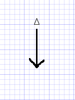
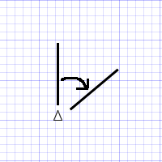
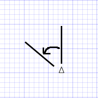
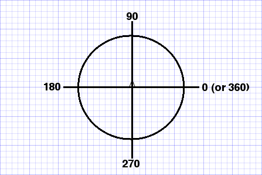

# Turtles App API

## Basics

- At the beginning, only one turtle whose name is :trinity (don't omit ':'
(colon), it is a Clojure keyword) will show up at the home position (center).
This turtle, :trinity, can move forward/backward,
change head angle clockwise/counterclockwise, or jump.

- Turtles can be added with/without a name.
If no name is given, a new turtle's name will be :smith0, :smith1,
etc.

- Each turtle can move independently giving a command with the name.
If no name is given, :trinity is the turtle to receive a command.


## Movement

All parameters to `forward`, `backward`, `right`, and `left` commands
are relative to the current position or angle.


| command | description |           |
| ------- | ----------- | ----------|
|`(forward len) (forward n len)`| moves the turtle forward by len.|  |
|`(backward len) (backward n len)`| moves the turtle backward by len.|  |
|`(right a) (right n a)`| changes the turtle head by a degrees clockwise.| |
|`(left a) (left n a)`| changes the turtle head by a degrees counterclockwise.| |
|`(undo) (undo n)`| undos the last line and back the turtle.||
|`(home) (home n)`| moves the turtle back to the home position.||
|`(home-all)`| moves all turtles back to the home position.||


### usage examples

```clojure
(forward 30)             ;; :trinity moves
(forward :smith0 40)     ;; :smith0 moves

(backward 35)            ;; :trinity moves
(backward :smith0 100)   ;; :smith0 moves

(right 45)               ;; :trinity tilts her head 45 degrees clockwise
(right :smith0 90)       ;; :smith0 tilts his head 90 degrees clockwise

(left 30)                ;; :trinity tilts her head 30 degrees counterclockwise
(left :smith0 135)       ;; :smith0 tilts his head 135 degrees counterclockwise

(undo)                   ;; :trinity's last line will be removed
(undo :smith0)           ;; :smith0's last line will be removed

(home)                   ;; moves :trinity back to the home position, center
(home :smith0)           ;; moves :smith0 back to the home position, center

(home-all)               ;; moves all turtles back to the home position
```


## Turtle

| command | description |
| ------- | ----------- |
|`(add-turtle) (add-turtle n)`| adds a turtle. if no name given, the turtle will be named, :smith0, :smith1, ...|
|`(turtle-names)`| returns all turtle names.|
|`(state) (state n)`| returns a current state of the turtle.|

The `state` command shows the *absolute* values not like relative values
used in `forward`, `backward`, `right` and `left`.

##### x and y in absolute values

|home      | both x and y are zero. `(x, y) = (0, 0)` |
|rightmost | x is 240, y is any. `(x, y) = (240, y)` |
|leftmost  | x is -240, y is any. `(x, y) = (-240, y)` |
|top       | x is any, y is 150. `(x, y) = (x, 150)` |
|bottom    | x is any, y is -150. `(x, y) = (x, -150)` |


##### angle in absolute degrees

|right  | 0 |
|top    | 90 |
|left   | 180 |
|bottom | 270 |




### usage examples

```clojure
(add-turtle)             ;; adds a turtle whose name is :smith0, then :smith1, ...
(add-turtle :neo)        ;; adds a turtle whose name is :neo

(turtle-names)           ;; returns all turtle names

(state)                  ;; returns :trinity's current state
(state :smith0)          ;; returns :smith0's current state
```


## Clean up

| command | description |
| ------- | ----------- |
|`(clean) (clean n)`| cleans all lines belong to the turtle. |
|`(clean-all)`| cleans all lines of all turtles. |

### usage examples

```clojure
(clean)                  ;; cleans all of :trinity's lines
(clean :smith0)          ;; cleans all of :smith0's lines

(clean-all)              ;; cleans all turtles all lines
```

## Initialize

| command | description |
| ------- | ----------- |
|`(init)`| makes back to the staring state. |

### usage examples

```clojure
(init)                   ;; makes back to the starting state, only :trinity is in home position
```


License
-------
<a rel="license"
href="http://creativecommons.org/licenses/by/4.0/deed.en_US"></a><br
/><span xmlns:dct="http://purl.org/dc/terms/"
href="http://purl.org/dc/dcmitype/Text" property="dct:title"
rel="dct:type">ClojureBridge Curriculum</span> by <span
xmlns:cc="http://creativecommons.org/ns#"
property="cc:attributionName">ClojureBridge</span> is licensed under a
<a rel="license"
href="http://creativecommons.org/licenses/by/4.0/deed.en_US">Creative
Commons Attribution 4.0 International License</a>.
